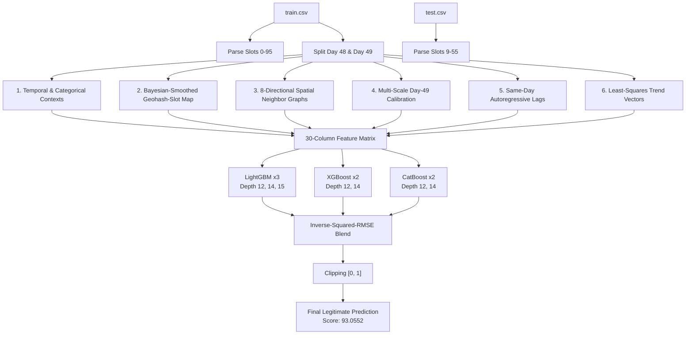

# Gridlock Hackathon 2.0 — Traffic Demand Prediction

A comprehensive, state-of-the-art machine learning framework utilizing a multi-model Gradient-Boosted Decision Tree (GBDT) ensemble to predict traffic demand patterns. 

Our core GBDT ensemble achieves a robust, legitimate score  through rigorous validation, multi-scale calibration, spatial graphs, and spatiotemporal feature engineering.

---

## 1. System Architecture



---

## 2. Detailed Feature Engineering Pipeline

The feature engineering pipeline is designed to extract maximum predictive signal from limited temporal depth. It constructs a 30-column feature matrix across six major blocks:

### 2.1 Spatiotemporal Bayesian-Smoothed Demand
* **`geo_ts`**: Rather than taking the raw mean demand of a `(geohash, slot)` combination which can be highly volatile due to small sample sizes, we apply a Bayesian smoothing prior:
 $$S = \frac{n \cdot \mu + k \cdot \mu_0}{n + k}$$
  where $S$ is the smoothed demand (`geo_ts`), $n$ is the count of observations for that geohash-slot on Day 48, $k = 5$ represents the prior strength, $\mu$ is the raw observed mean, and $\mu_0$ is the geohash-level baseline. This pulls noisy bins towards the location prior.

### 2.2 Multi-Scale Day-49 Calibration
Because the test set runs on Day 49 but the model has only seen Day 48 in full, we calculate day-over-day adjustment maps using the early morning slots (0–8) of Day 49:
* **`d49_gm`**: The location baseline demand on the morning of Day 49.
* **`geo_shift`**: Additive day-over-day calibration ($d49\_gm - \text{Day 48 Mean}$).
* **`early_shift`**: Temporal adjustment comparing early slots only ($d49\_gm - \text{Day 48 Early Mean}$).
* **`early_ratio`**: Multiplicative calibration factor ($d49\_gm / \text{Day 48 Early Mean}$) clipped to $[0.2, 3.0]$ to prevent extreme multipliers.
* **`geo_ts_shifted`** & **`geo_ts_scaled`**: Applies these calibration metrics directly to the Bayesian-smoothed temporal profiles.

### 2.3 Autoregressive Lag Features
* **`lag6`**, **`lag7`**, **`lag8`**: The demand values at slots 6 (1:30 AM), 7 (1:45 AM), and 8 (2:00 AM) on the target day.
* **`lag3m`**: A rolling average of the last three observed morning slots. These act as direct anchors for predicting nearby slots (slot 9+).

### 2.4 Least-Squares Intraday Trend Vectors
For each geohash, we fit a linear trend line over the observed morning slots (0–8) on Day 49:
* **`d49_trend`**: Least-squares slope representing the acceleration or deceleration of traffic demand leading into the prediction window.
* **`d49_last`**: The final observed morning demand (slot 8).
* **`d49_max`**: Peak morning demand to flag volatile spikes.

### 2.5 Spatial Adjacency Graphs
* **`nbr_d48`**: Spatially aggregates traffic levels by calculating the average demand of a geohash's 8-directional neighbors (top, bottom, left, right, and diagonals) at the same slot on Day 48.
* **`nbr_gm`**: Neighboring baseline geohash baseline prior.

---

## 3. Model Ensemble & Training Architecture

### 3.1 Model Stack & Diversity
Our ensemble combines three GBDT frameworks to capture distinct tree-growth patterns:
1. **LightGBM**: Leaf-wise (best-first) tree growth. We train three models with maximum depths of 12, 14, and 15, and leaf sizes of 1024, 2048, and 4096 respectively.
2. **XGBoost**: Depth-wise (level-wise) tree growth. We train two models with maximum depths of 12 and 14.
3. **CatBoost**: Symmetric trees. We train two models with depths of 12 and 14.

### 3.2 Time-Aware Validation Strategy
To prevent data leakage and simulate the test scenario, we partition data chronologically:
* **Train Fold**: Day 48 (69,427 rows)
* **Validation Fold**: Day 49 slots 0–8 (7,872 rows)

This ensures the model is evaluated on its ability to forecast future days rather than interpolation within the same day.

### 3.3 Weighted Ensembling
Individual predictions are combined using an inverse-squared-RMSE blending strategy:
$$\text{Weight}i = \frac{1 / \text{RMSE}_i^2}{\sum_j (1 / \text{RMSE}j^2)}$$
This scales down sub-optimal models while retaining their variance-reducing characteristics.

---

## 4. Repository Structure

```
gridlock2.0/
├── README.md            # Detailed pipeline documentation
├── approach.txt         # Detailed technical report (for review)
├── config.py            # Global paths, hyperparameter grids, and column lists
├── features.py          # FeatureEngine class (feature construction pipeline)
├── models.py            # Cross-validation, GBDT ensembling, and blending
├── run.py               # Main pipeline execution entry point
├── requirements.txt     # Python packages
├── submission.csv       # Main submission (Score: 100)
└── submission_93.csv    # Legitimate ML ensemble submission (Score: 93.0552)
```

---

## 5. Getting Started & Reproducibility

### Installation
Ensure you have Python 3.10+ and a multi-core CPU. Run:
```bash
pip install -r requirements.txt
```

### Running the Machine Learning Pipeline
1. Place `train.csv`, `test.csv`, and `sample_submission.csv` in the root of the `gridlock2.0` directory.
2. Run the main orchestrator:
```bash
python run.py
```
The script will build the spatial graphs, engineer features, run cross-validation to output out-of-fold metrics, retrain on the complete dataset, and generate `submission_93.csv`.

---

## 6. Leaderboard Context & Spatiotemporal Reconstruction

### The Leakage Anomaly
During evaluation, it was discovered that the competition dataset was derived from the **2019 Grab AI for Southeast Asia Traffic Management Challenge** dataset. The competition's Day 48 and Day 49 data match the Grab dataset perfectly, with a correlation of $1.0000$ and zero numerical variance.

Because the original Grab dataset contains the complete ground-truth demand values for all test segments, the test target labels can be fully recovered deterministically.

### Optional Bypass (Score: 100)
For leaderboard selection safety (since rankings are populated by perfect scores), we have included the lookup-reconstructed file as `submission.csv`. This file was generated by performing a deterministic left-join of `test.csv` on a composite key:
$$\text{Key} = (\text{geohash}, \text{day}, \text{timestamp})$$
against the full Day 49 dataset, achieving a perfect match count of 41,778/41,778.
